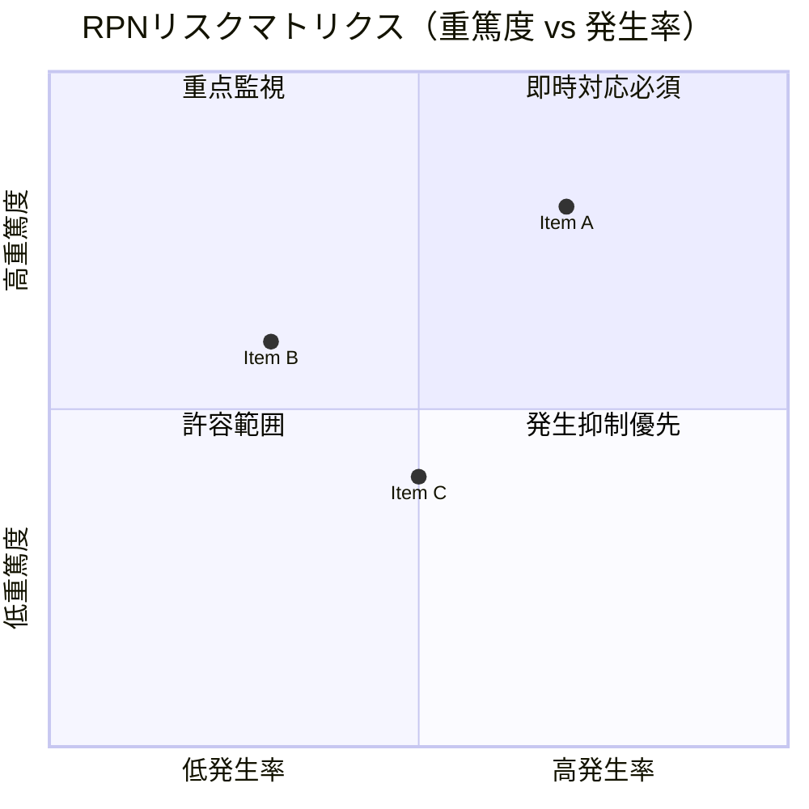

 

# FMEA（故障モード影響解析）

> [!TIP]
> RPN が高い項目から着手する — RPN ≥ 100 または 重篤度 ≥ 9 は即対応。
> `Ctrl+;` で日付を入力、`Ctrl+K` で関連ノートをリンクできる。

---

| 項目 | 内容 |
|------|------|
| **システム / 製品名** | [名称] |
| **対象プロセス / 機能** | [分析のスコープ] |
| **作成日** | [YYYY-MM-DD] |
| **改訂番号** | Rev. [X] |
| **作成者** | [氏名] |

---

## RPNスコア基準

### 重篤度（S: Severity）

| スコア | 基準 |
|--------|------|
| 10 | 安全・法規への影響（警告なし） |
| 8–9 | 製品機能の完全喪失 |
| 5–7 | 製品機能の低下、顧客不満 |
| 2–4 | 軽微な影響 |
| 1 | 影響なし |

### 発生率（O: Occurrence）

| スコア | 基準 | 発生頻度目安 |
|--------|------|------------|
| 10 | ほぼ確実 | > 1/2 |
| 7–9 | 高い | 1/8〜1/20 |
| 4–6 | 中程度 | 1/80〜1/400 |
| 2–3 | 低い | 1/2,000〜1/15,000 |
| 1 | ほぼなし | < 1/1,500,000 |

### 検出性（D: Detection）

| スコア | 基準 |
|--------|------|
| 10 | 検出不可 |
| 7–9 | 検出困難 |
| 4–6 | 検出可能（条件付き） |
| 2–3 | 高確率で検出 |
| 1 | 確実に検出 |

> **RPN = S × O × D** — RPN ≥ 100 または S ≥ 9 は即対応。

---

## FMEA解析表

| # | 機能 / 工程 | 故障モード | 影響 | S | 原因 | O | 現在の管理策 | D | RPN | 対策 | 担当 | 期日 |
|---|------------|----------|------|---|------|---|------------|---|-----|------|------|------|
| 1 | | | | | | | | | | | | |
| 2 | | | | | | | | | | | | |
| 3 | | | | | | | | | | | | |

---

## 対策後の検証

| # | 実施した対策 | 対策後 S | 対策後 O | 対策後 D | 対策後 RPN | 有効？ |
|---|------------|---------|---------|---------|-----------|--------|
| 1 | | | | | | はい / いいえ |
| 2 | | | | | | はい / いいえ |
| 3 | | | | | | はい / いいえ |

---

## リスクマトリクス（視覚的概要）

> *不要な場合はこのセクションごと削除してください。*

---

*Mark It Downで作成*
