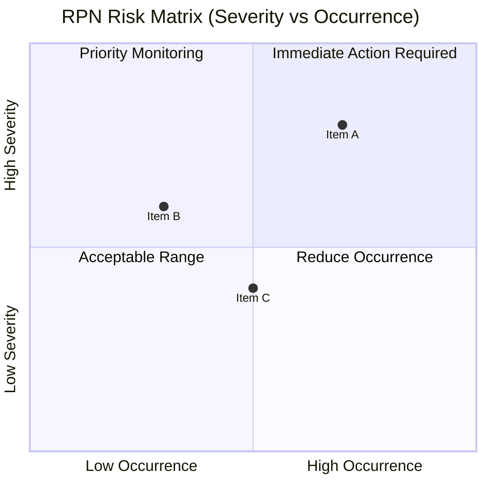

 

# FMEA (Failure Mode and Effects Analysis)

> [!TIP]
> Focus on high-RPN items first — RPN ≥ 100 or Severity ≥ 9 requires immediate action.
> Use `Ctrl+;` to stamp dates and `Ctrl+K` to link related documents.

---

| Field | Value |
|-------|-------|
| **System / Product** | [Name] |
| **Process / Function** | [Scope of analysis] |
| **Date** | [YYYY-MM-DD] |
| **Revision** | Rev. [X] |
| **Author** | [Name] |

---

## RPN Scoring Criteria

### Severity (S)

| Score | Criteria |
|-------|----------|
| 10 | Safety / regulatory impact (no warning) |
| 8–9 | Complete loss of product function |
| 5–7 | Degraded function, customer dissatisfaction |
| 2–4 | Minor impact |
| 1 | No effect |

### Occurrence (O)

| Score | Criteria | Approximate Rate |
|-------|----------|-----------------|
| 10 | Almost certain | > 1 in 2 |
| 7–9 | High | 1 in 8 – 1 in 20 |
| 4–6 | Moderate | 1 in 80 – 1 in 400 |
| 2–3 | Low | 1 in 2,000 – 1 in 15,000 |
| 1 | Remote | < 1 in 1,500,000 |

### Detection (D)

| Score | Criteria |
|-------|----------|
| 10 | Undetectable |
| 7–9 | Difficult to detect |
| 4–6 | Detectable (conditional) |
| 2–3 | High probability of detection |
| 1 | Certain detection |

> **RPN = S × O × D** — Items with RPN ≥ 100 or S ≥ 9 require immediate action.

---

## FMEA Worksheet

| # | Function / Process | Failure Mode | Effect | S | Cause | O | Current Controls | D | RPN | Action | Owner | Due |
|---|-------------------|-------------|--------|---|-------|---|-----------------|---|-----|--------|-------|-----|
| 1 | | | | | | | | | | | | |
| 2 | | | | | | | | | | | | |
| 3 | | | | | | | | | | | | |

---

## After-Action Verification

| # | Action Taken | New S | New O | New D | New RPN | Effective? |
|---|-------------|-------|-------|-------|---------|------------|
| 1 | | | | | | Yes / No |
| 2 | | | | | | Yes / No |
| 3 | | | | | | Yes / No |

---

## Risk Matrix (Visual Overview)

> *Delete this section if not needed.*

---

*Captured with Mark It Down*
