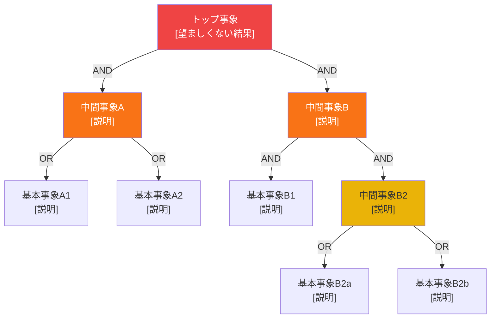

 

# FTA（故障の木解析）

> [!TIP]
> トップ事象から下方に展開する — 各ゲートは必ず AND か OR を明記する。
> `Ctrl+;` で日付を入力、`Ctrl+K` で関連ノートをリンクできる。

---

| 項目 | 内容 |
|------|------|
| **トップ事象** | [望ましくない結果] |
| **システム境界** | [分析のスコープ] |
| **分析日** | [YYYY-MM-DD] |
| **作成者** | [氏名] |

---

## ゲート記号凡例

| 記号 | 意味 |
|------|------|
| **AND** | 全ての入力が成立したとき出力 |
| **OR** | いずれかの入力が成立したとき出力 |
| ⬡ 基本事象 | これ以上分解しない故障 |
| ◇ 未展開事象 | データ不足・範囲外 |

---

## 故障の木

> *システムに合わせてダイアグラムを修正する。不要な場合はこのセクションごと削除してください。*

---

## カット集合（Minimal Cut Sets）

> カット集合 = トップ事象を引き起こす最小の基本事象の組み合わせ。

| カット集合 | 構成事象 | 発生確率（概算） | 優先度 |
|-----------|---------|----------------|--------|
| CS-1 | [B1] | | 高 / 中 / 低 |
| CS-2 | [B3 AND B4] | | 高 / 中 / 低 |
| CS-3 | [B3 AND B5] | | 高 / 中 / 低 |

---

## リスク優先順位付け

| 基本事象 | 説明 | 発生確率 | 影響度 | 推奨アクション |
|---------|------|---------|--------|--------------|
| B1 | | 高 / 中 / 低 | | |
| B2 | | 高 / 中 / 低 | | |
| B3 | | 高 / 中 / 低 | | |

---

*Mark It Downで作成*
