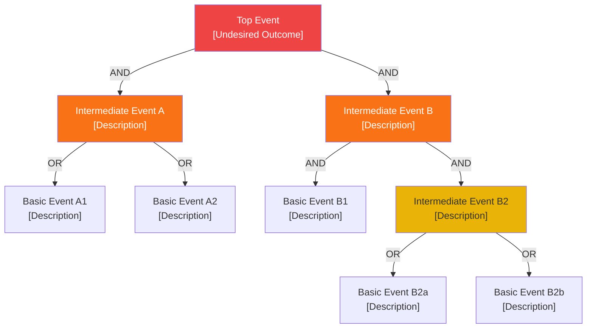

 

# FTA (Fault Tree Analysis)

> [!TIP]
> Start from the top event and decompose downward — each gate must be either AND or OR.
> Use `Ctrl+;` to stamp dates and `Ctrl+K` to link related documents.

---

| Field | Value |
|-------|-------|
| **Top Event** | [Undesired outcome] |
| **System Boundary** | [Scope of analysis] |
| **Date** | [YYYY-MM-DD] |
| **Author** | [Name] |

---

## Gate Symbol Legend

| Symbol | Meaning |
|--------|---------|
| **AND** | Output occurs when ALL inputs are true |
| **OR** | Output occurs when ANY input is true |
| ⬡ Basic Event | Failure that is not decomposed further |
| ◇ Undeveloped Event | Insufficient data or out of scope |

---

## Fault Tree

> *Modify this diagram to match your system. Delete this section if not needed.*

---

## Minimal Cut Sets

> A cut set is the smallest combination of basic events that causes the top event.

| Cut Set | Basic Events | Estimated Probability | Priority |
|---------|-------------|----------------------|----------|
| CS-1 | [B1] | | High / Medium / Low |
| CS-2 | [B3 AND B4] | | High / Medium / Low |
| CS-3 | [B3 AND B5] | | High / Medium / Low |

---

## Risk Prioritization

| Basic Event | Description | Probability | Impact | Recommended Action |
|-------------|-------------|-------------|--------|--------------------|
| B1 | | High / Medium / Low | | |
| B2 | | High / Medium / Low | | |
| B3 | | High / Medium / Low | | |

---

*Captured with Mark It Down*
