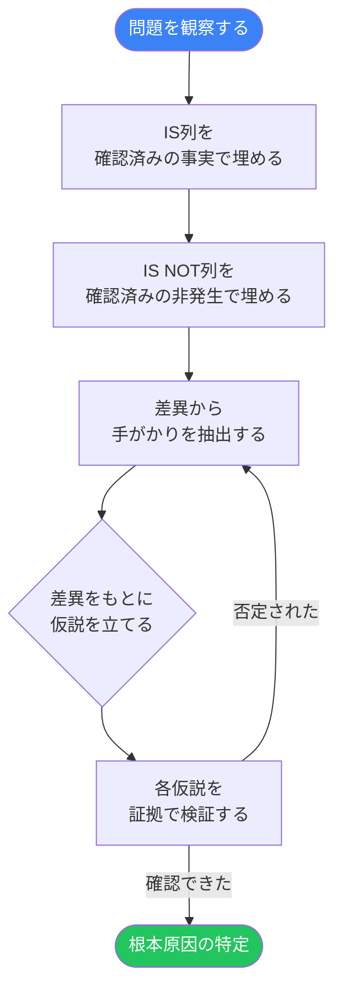

 

# Is / Is Not 分析

> [!TIP]
> ISの列には確認できた事実だけを記入し、同じくらい丁寧にIS NOTの列も埋めましょう。
> `Ctrl+;` で記録日を入力、`Ctrl+K` で関連ノートや調査結果を検索。

---

## 問題の説明

[問題を1〜2文の事実として記述してください。この段階では原因に関する推測は避けましょう。]

> **問題:** [観察された事象の一文サマリー]

**発見日:** [YYYY-MM-DD]
**報告者 / 発見者:** [氏名、チーム、または情報源]

---

## Is / Is Not マトリクス

> [!NOTE]
> このテクニックの力はIS NOTの列にあります。IS NOTを埋めるほど可能性が絞り込まれ、原因に近づきます。「〜ではない」が一つ確定するたびに、候補原因のクラスが一つ除外されます。

| 観点 | IS（該当する） | IS NOT（該当しない） | 差異からの手がかり |
|------|--------------|--------------------|--------------------|
| **What 何が** — 何が問題か | [具体的に何が影響を受けているか] | [似ているが影響を受けていないもの] | [一方だけ影響を受ける理由は何か？] |
| **Where どこで** — どこで起きるか | [発生する場所・システム・状況] | [似た場所や状況で発生しないもの] | [その場所の何が違うのか？] |
| **When いつ** — いつ起きるか | [発生する時間帯・条件・順序] | [発生しない時間帯や条件] | [その時に何が変わっているのか？] |
| **Who 誰が** — 誰が関係するか | [経験している人・役割・ユーザー] | [似た立場で経験していない人・役割] | [そのグループの何が違うのか？] |
| **How Much 頻度・規模** — どの程度か | [発生時の規模・頻度・深刻さ] | [観察されない規模・頻度] | [その境界線は何を示しているか？] |

---

## 絞り込みプロセス

> *全体像 ― 不要なら削除してください。*

---

## 仮説

[「差異からの手がかり」列をもとに、候補となる原因を挙げてください。それぞれの仮説は、ISの事例では問題が発生し、IS NOTの事例では発生しない理由を説明できるものにしましょう。]

| 仮説 | IS / IS NOTの根拠 | 検証方法 | 優先度 |
|------|-----------------|----------|--------|
| [候補原因 #1] | [どのIS / IS NOTのセルが支持しているか] | [確認または否定するためのテスト・観察・データ] | [高 / 中 / 低] |
| [候補原因 #2] | [どのIS / IS NOTのセルが支持しているか] | [確認または否定するためのテスト・観察・データ] | [高 / 中 / 低] |
| [候補原因 #3] | [どのIS / IS NOTのセルが支持しているか] | [確認または否定するためのテスト・観察・データ] | [高 / 中 / 低] |

---

## 次のアクション

- [ ] 結論を出す前に、未記入のIS / IS NOTセルを埋める
- [ ] 最優先の仮説から検証を始める
- [ ] 各仮説を確認・否定する証拠を記録する
- [ ] 調査中に新たな事実が判明したらマトリクスを更新する
- [ ] 原因が確定したらステークホルダーに共有する
- [ ] 是正処置を定義し、担当者をアサインする

---

**レビュー日:** [YYYY-MM-DD]

*Mark It Downで作成*
