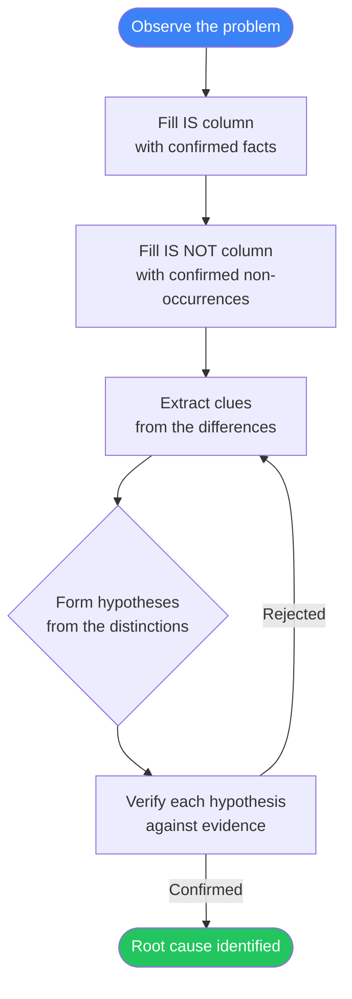

 

# Is / Is Not Analysis

> [!TIP]
> Fill the IS column with confirmed facts, then challenge yourself to fill the IS NOT column just as thoroughly.
> Use `Ctrl+;` to stamp the date and `Ctrl+K` to link related notes or investigations.

---

## Problem Statement

[Describe the problem in one or two factual sentences. Avoid assumptions about causes at this stage.]

> **Problem:** [One-sentence summary of the observed issue]

**Date observed:** [YYYY-MM-DD]
**Reported by / Discovered by:** [Name, team, or source]

---

## Is / Is Not Matrix

> [!NOTE]
> The power of this technique lies in the IS NOT column — it eliminates possibilities and narrows focus. Every "is not" rules out a class of causes.

| Dimension | IS | IS NOT | Clues from the difference |
|-----------|-----|--------|---------------------------|
| **What** — What is the problem? | [What specifically is affected] | [What is similar but NOT affected] | [Why might one be affected and not the other?] |
| **Where** — Where does it occur? | [Locations, systems, or contexts where it happens] | [Similar locations or contexts where it does NOT happen] | [What is different about these places?] |
| **When** — When does it occur? | [Times, conditions, or sequences when it happens] | [Times or conditions when it does NOT happen] | [What changed or differs at those times?] |
| **Who** — Who is involved? | [People, roles, or users who experience it] | [Similar people or roles who do NOT experience it] | [What is different about these groups?] |
| **How Much** — Scale and frequency | [Extent, frequency, or severity when it occurs] | [What levels or frequencies are NOT observed] | [What does the boundary in scale suggest?] |

---

## Narrowing-Down Process

> *Visual overview — delete this section if not needed.*

---

## Hypotheses

[Use the "Clues from the difference" column to generate candidate causes. Each hypothesis should explain why the problem IS present in the IS cases and absent in the IS NOT cases.]

| Hypothesis | Evidence from IS / IS NOT | Verification Method | Priority |
|------------|--------------------------|---------------------|----------|
| [Candidate cause #1] | [Which IS / IS NOT cells support this?] | [Test, observation, or data to confirm or refute] | [High / Medium / Low] |
| [Candidate cause #2] | [Which IS / IS NOT cells support this?] | [Test, observation, or data to confirm or refute] | [High / Medium / Low] |
| [Candidate cause #3] | [Which IS / IS NOT cells support this?] | [Test, observation, or data to confirm or refute] | [High / Medium / Low] |

---

## Next Steps

- [ ] Complete any incomplete IS / IS NOT cells before drawing conclusions
- [ ] Verify the highest-priority hypothesis first
- [ ] Document evidence that confirms or rejects each hypothesis
- [ ] Update the matrix if new facts emerge during investigation
- [ ] Share findings with stakeholders once a cause is confirmed
- [ ] Define corrective action and assign an owner

---

**Review date:** [YYYY-MM-DD]

*Captured with Mark It Down*
