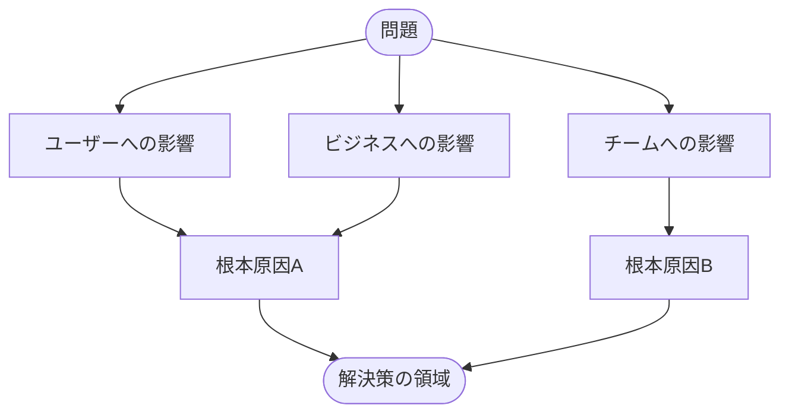

 

# 問題定義

> [!TIP]
> 解決策に飛びつく前に、問題を定義しましょう。まず影響と根本原因を記入。
> `Ctrl+;` で分析日を記録、`Ctrl+K` で関連ノートを検索。

---

## 問題の定義

[2〜3文で問題を記述してください。何が起きているか vs 何が起きるべきかを具体的に。]

> **一文で:** [簡潔な問題サマリー]

## 影響

**誰が影響を受けるか？** [ユーザー、チーム、顧客など]

**深刻度:** [致命的 / 高 / 中 / 低]

**現れ方:**

- [観察可能な症状 #1]
- [観察可能な症状 #2]
- [観察可能な症状 #3]

> [!NOTE]
> [可能であれば影響を数値化しましょう。例: 「毎日約200人のユーザーに影響」「各デプロイに15分追加」]

## インパクトマップ

> *全体像 ― 不要なら削除してください。*

## 根本原因

- [潜在的な根本原因 #1]
- [潜在的な根本原因 #2]
- [潜在的な根本原因 #3]

> [!TIP]
> 根本原因をより深く掘り下げるには、**なぜなぜ分析**テンプレートを使用しましょう。

## 制約条件

- [予算、タイムライン、またはリソースの制限]
- [技術的な制約]
- [組織的またはポリシーの制約]

## 成功基準

- [ ] [測定可能な成果 #1、例: 「エラー率が1%未満に低下」]
- [ ] [測定可能な成果 #2]
- [ ] [測定可能な成果 #3]
- [ ] [ステークホルダーの承認を取得]

## ネクストステップ

1. [即座に取るべきアクション]
2. [フォローアップの調査または決定]
3. [担当者と目標日]

---

*Mark It Downで作成*
