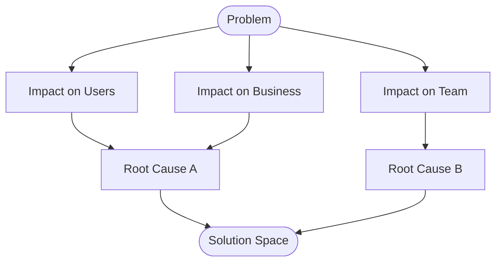

 

# Problem Statement

> [!TIP]
> Define the problem before jumping to solutions. Fill in Impact and Root Causes first.
> Use `Ctrl+;` to date your analysis and `Ctrl+K` to find related notes.

---

## Define the Problem

[Describe the problem in 2-3 sentences. Be specific about what is happening versus what should be happening.]

> **In one sentence:** [Concise problem summary]

## Impact

**Who is affected?** [Users, team, customers, etc.]

**Severity:** [Critical / High / Medium / Low]

**How it manifests:**

- [Observable symptom #1]
- [Observable symptom #2]
- [Observable symptom #3]

> [!NOTE]
> [Quantify the impact if possible, e.g., "Affects ~200 users daily" or "Adds 15 minutes to each deployment."]

## Impact Map

> *Visual overview — delete this section if not needed.*

## Root Causes

- [Potential root cause #1]
- [Potential root cause #2]
- [Potential root cause #3]

> [!TIP]
> Use the **Five Whys Analysis** template to dig deeper into root causes.

## Constraints

- [Budget, timeline, or resource limitation]
- [Technical constraint]
- [Organizational or policy constraint]

## Success Criteria

- [ ] [Measurable outcome #1, e.g., "Error rate drops below 1%"]
- [ ] [Measurable outcome #2]
- [ ] [Measurable outcome #3]
- [ ] [Stakeholder sign-off obtained]

## Next Steps

1. [Immediate action]
2. [Follow-up investigation or decision]
3. [Owner and target date]

---

*Captured with Mark It Down*
