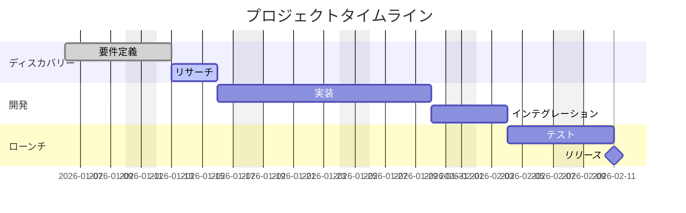

 

# プロジェクト概要

> [!TIP]
> まず目的とスコープを記入してチームの認識を揃えましょう。リスクは定期的に見直してください。
> `Ctrl+;` でマイルストーンの日付を記録、`Ctrl+K` で関連プロジェクトノートを検索。

---

## 目的

[このプロジェクトは何を達成しようとしているか？1〜2文で目標を述べてください。]

## 背景

[なぜ今このプロジェクトが必要か？新しいチームメンバーがモチベーションを理解するのに必要なコンテキストは？]

> [!NOTE]
> [過去の決定、リサーチ、または関連プロジェクトがあればリンクしましょう。]

## スコープ

### スコープ内

- [含まれる機能、成果物、または作業領域]
- [含まれる機能、成果物、または作業領域]
- [含まれる機能、成果物、または作業領域]

### スコープ外

- [明示的に除外する項目とその理由]
- [明示的に除外する項目とその理由]

## 成果物

- [ ] [成果物 #1 と受け入れ基準]
- [ ] [成果物 #2 と受け入れ基準]
- [ ] [成果物 #3 と受け入れ基準]
- [ ] [ドキュメントと引き継ぎの完了]

## タイムライン

> *全体像 ― 不要なら削除してください。*

| フェーズ | 期間 | マイルストーン |
|----------|------|----------------|
| **ディスカバリー** | [開始 — 終了] | [主な成果、例: 「要件確定」] |
| **開発** | [開始 — 終了] | [主な成果、例: 「MVPレビュー準備完了」] |
| **テスト** | [開始 — 終了] | [主な成果、例: 「QA承認」] |
| **ローンチ** | [日付] | [主な成果、例: 「本番リリース」] |

## ステークホルダー

| 役割 | 名前 | 責任 |
|------|------|------|
| **スポンサー** | [名前] | [最終承認] |
| **リード** | [名前] | [日常の意思決定] |
| **コントリビューター** | [名前] | [担当領域] |

## リスク

| リスク | 発生確率 | 影響度 | 軽減策 |
|--------|----------|--------|--------|
| [リスクの説明] | 低 / 中 / 高 | 低 / 中 / 高 | [軽減計画] |
| [リスクの説明] | 低 / 中 / 高 | 低 / 中 / 高 | [軽減計画] |
| [リスクの説明] | 低 / 中 / 高 | 低 / 中 / 高 | [軽減計画] |

## 成功指標

- **[指標名]:** [目標値と測定方法]
- **[指標名]:** [目標値と測定方法]
- **[指標名]:** [目標値と測定方法]

---

*Mark It Downで作成*
