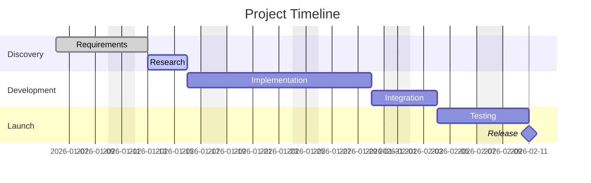

 

# Project Brief

> [!TIP]
> Fill in Objective and Scope first to align the team. Revisit Risks regularly.
> Use `Ctrl+;` to date milestones and `Ctrl+K` to find related project notes.

---

## Objective

[What is this project trying to achieve? State the goal in one or two sentences.]

## Background

[Why is this project needed now? What context does a new team member need to understand the motivation?]

> [!NOTE]
> [Link to prior decisions, research, or related projects if available.]

## Scope

### In Scope

- [Feature, deliverable, or work area included]
- [Feature, deliverable, or work area included]
- [Feature, deliverable, or work area included]

### Out of Scope

- [Explicitly excluded item and why]
- [Explicitly excluded item and why]

## Deliverables

- [ ] [Deliverable #1 with acceptance criteria]
- [ ] [Deliverable #2 with acceptance criteria]
- [ ] [Deliverable #3 with acceptance criteria]
- [ ] [Documentation and handoff complete]

## Timeline

> *Visual overview — delete this section if not needed.*

| Phase | Dates | Milestone |
|-------|-------|-----------|
| **Discovery** | [Start — End] | [Key output, e.g., "Requirements finalized"] |
| **Development** | [Start — End] | [Key output, e.g., "MVP ready for review"] |
| **Testing** | [Start — End] | [Key output, e.g., "QA sign-off"] |
| **Launch** | [Date] | [Key output, e.g., "Production release"] |

## Stakeholders

| Role | Name | Responsibility |
|------|------|---------------|
| **Sponsor** | [Name] | [Final approval] |
| **Lead** | [Name] | [Day-to-day decisions] |
| **Contributor** | [Name] | [Specific area] |

## Risks

| Risk | Probability | Impact | Mitigation |
|------|-------------|--------|------------|
| [Risk description] | Low / Medium / High | Low / Medium / High | [Mitigation plan] |
| [Risk description] | Low / Medium / High | Low / Medium / High | [Mitigation plan] |
| [Risk description] | Low / Medium / High | Low / Medium / High | [Mitigation plan] |

## Success Metrics

- **[Metric name]:** [Target value and how it will be measured]
- **[Metric name]:** [Target value and how it will be measured]
- **[Metric name]:** [Target value and how it will be measured]

---

*Captured with Mark It Down*
